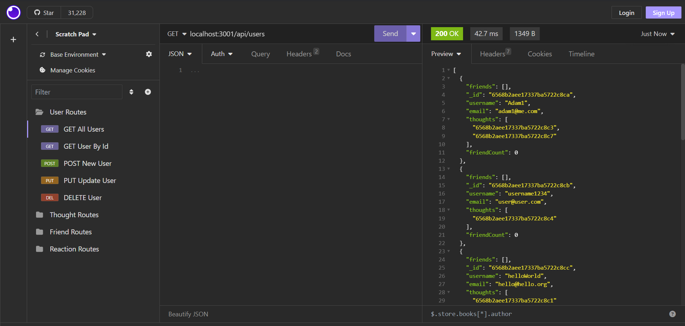

# Social Media API

## Table of Contents
-[Description](#description)  
-[Installation](#installation)  
-[Usage](#usage)  
-[Contributing](#contributing)  
-[Tests](#tests)  
-[Credits](#credits)  
-[License](#license)  
-[Questions](#questions)

## Description
This application is a backend for a social-networking site. It was created because many social networks use NoSQL databases, specifically MongoDB. This application can easily merge with a front-end for a social-networking site, as all of the routes and database connections are there. This API has routes that can create, update, and delete users; create, update, and delete thoughts; create and delete friends and thought reactions; it can also get all users and thoughts, as well as get a specific user or thought. This application makes use of the following:  nodemon for live updates while I was developing the app, express for routing, mongoose as an ODM for MongoDB, and node.js.

## Installation
To install this application, run the command `npm i` to install express and mongoose for the app. Next, you can run the seeds if you want starting data by running the command, `npm run seed`, or you can start with an empty app by not running the seeds. To start the application, run the command `npm start` of `npm run start`. From there, the server will run and the app has started.

## Usage
To use this application, first follow the installation instructions above. Once the server is running, open a back-end environment like Insomnia to be able to run the routes. Since this app isn't deployed with a front-end, we will be using localhost:3001 to run our routes. Each route defined will start after `localhost:3001`. To get all users use this GET route `/api/users`. To get all thoughts use this GET route: `/api/thoughts`. To get a single user use this GET route: `/api/users/:userID`. To get a specific thought use this GET route: `/api/thoughts/:thoughtId`. To add a new user use this POST route: `/api/users`, with a username an email in the request body. To add a new thought use this POST route: `/api/thoughts`, with thoughtText and username in the request body. To update a user use this PUT route: `/api/users/:userId`, with the updated info in the request body. To update a thought use this PUT route: `/api/thoughts/:thoughtID`, with the updated thought info in the request body. To delete a user and their associated thoughts use this DELETE route: `/api/users/:userId`. To delete a thought use this DELETE route: `/api/thoughts/:thoughtId`. To add a new friend to a user's friend list use this POST route: `/api/users/:userId/friends/:friendId`. To delete a friend from a user's friend list use this DELETE route: `/api/users/:userId/friends/:friendId`. To add a reaction to a thought use this POST route: `/api/thoughts/:thoughtid/reactions`, with reactionBody and username in the request body. To delete a reaction to a thought use this DELETE route: `/api/thoughts/:thoughtId/reactions/:reactionId`.

## Contributing
To contribe, fork the project, create a branch to work on, edit that branch, and then create a pull request. If the edits are approved, your contributions will be added.

## Tests
To test this application, run the seeds by running the command `npm run seed`. Test data will populate into the database and from there you can test each of the routes using that data.

## Credits
This application uses references from a Uconn web development bootcamp in the following repo: https://git.bootcampcontent.com/University-of-Connecticut/CONN-VIRT-FSF-PT-07-2023-U-LOLC.git. There are also references to the documentation for express, node.js, mongoDB, and mongoose.

## License
This project is not protected under any license.

## Questions
To view more of my work, view my GitHub profile: [adaking1](https://github.com/adaking1)

If you have any questions about this project please email me here: kinga1215@yahoo.com

